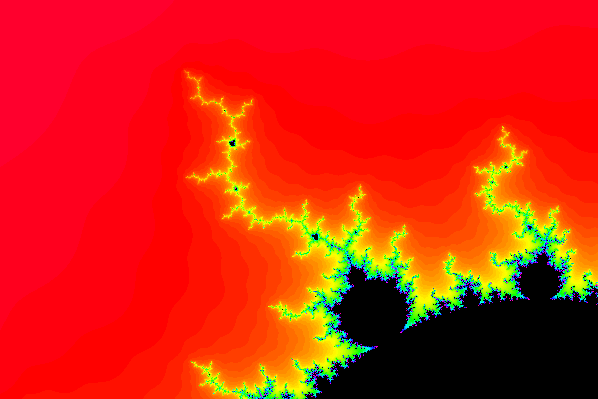

# p5js

Collection of smaller p5js.org projects

## [Mandelbrot set](mandelbrot)

See [here on p5js.org](https://editor.p5js.org/kreier/sketches/LwK3EW-Os) or in the [sourcecode](mandelbrot).

  

## [Disruption](disruption)

See [here on p5js.org](https://editor.p5js.org/kreier/sketches/7Uwz1IDW6) or in the [sourcecode](disruption) here on GitHub.

 

## [Circle K](circle_k)

## Generative art

More on [the repository for ssis-aa/generative-art-collaboration2022](https://github.com/ssis-aa/generative-art-collaboration2022).

 

## [Train your own neuroal network](click-classifier)

Daniel Shiffman made a great [Youtube video](https://youtu.be/8HEgeAbYphA) for his channel [Codingtrain](https://thecodingtrain.com/) in November 2019. The code on p5js creates something like this:

