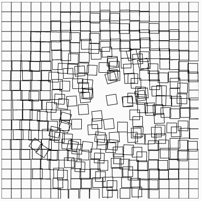

# circle_k_project - Matthew Rangstrup

This is a fork of Matthew's project from Advanced Automation 2021-2022. The result looks like this:



## Code

There are only a few lines necessary:

``` js
function setup() {
  CanvasX = 400
  CanvasY = 400
  //disruption point 1
  Disruption1X = 200
  Disruption1Y = 200
  //disruption point 2 - irrelevant for now, but can be changed if desired
  // Disruption2X = 200
  // Disruption2Y = 400
  Step = 20 
  createCanvas(CanvasX, CanvasY)

//creates a square grid, and creates disruptions based on the distance of the squares from the 'disruption points'
  for(var j = 0; j<Step; j++){
    for(var i = 0; i<Step;i++){ 
      RandomX = random(1,100)/10
      RandomY = random(1,100)/10
      noFill()
      
      
     //if the distance from a disruption point to the square goes below a threshold, then create a random amount of disruption on that square
      let distance1 = dist(Disruption1X,Disruption1Y,CanvasX/Step*i,CanvasY/Step*j)
      // let distance2 = dist(Disruption2X,Disruption2Y,CanvasX/Step*i,CanvasY/Step*j)
      rotation = random(-PI,PI)/30
      if (distance1<200){
        rotate(rotation * (5000/pow(distance1, 2)))
        square(CanvasX/Step*i+RandomX * (100/pow(distance1, 2)), CanvasY/Step*j+RandomY * (100/pow(distance1, 2)), CanvasX/Step)
        rotate(rotation*-1 * (5000/pow(distance1, 2)))
      } else{
        square(CanvasX/Step*i, CanvasY/Step*j, CanvasX/Step) 
      }
    }
  }
}
```
